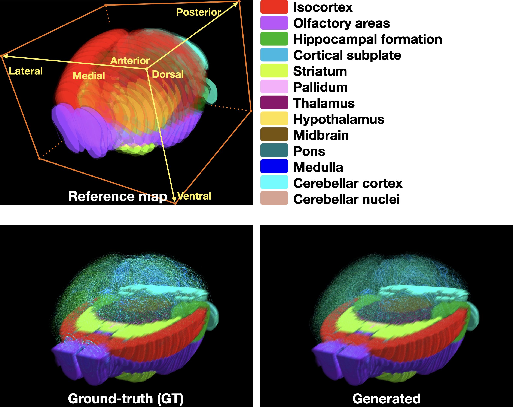

# [Tera-MIND: Tera-scale mouse brain simulation via spatial mRNA-guided diffusion](https://musikisomorphie.github.io/Tera-MIND.html) 

<div align="center">

[](https://musikisomorphie.github.io/Tera-MIND.html)
[](https://arxiv.org/)
[](https://opensource.org/licenses/MIT)
</div>

Jiqing Wu, Ingrid Berg, Yawei Li, Ender Konukoglu, Viktor H. Koelzer 

<p align="center">
  
<br>
The generated mouse brain at the scale of 0.77 x 10<sup>12</sup> voxels (Main result).        
</p>


## Conda environment
In the linux system, you could create the conda env from scratch:

```
conda create -n tera-mind python=3.12
conda activate tera-mind
```

Then, install the necessary packages as follows
```
pip install torch==2.5.0 torchvision==0.20.0 torchaudio==2.5.0 --index-url https://download.pytorch.org/whl/cu118

pip install pytorch-lightning==2.5.0 zarr==2.14.1 scipy opencv-python matplotlib seaborn pandas einops timm cellpose sparse 

pip install git+https://github.com/openai/CLIP.git

conda install conda-forge::pyvips
```

Note that higher cuda versions (>`cu118`) should also work. The compatible version of zarr package is rather limited, e.g., `2.14`. To avoid dependency issues, it is recommended to install `pyvips` via conda. 
Please check [environment.yml](environment.yml) for more details.


## Training data 

Upcoming soon.
The whole training data will be available in [Brain Image Library](https://www.brainimagelibrary.org/).

## Train the Tera-MIND model 

- 2 x A100 40GB GPUs 

For training the model, you could run the [train.sh](train.sh) script while modifying the `--data_path` and `--mouse` parameters.

```
python -m train --batch_size 32 --patch_size 64 --mouse ${mouse_id} \
       --rna_slc 4 --data_path ${data_pth}
```


## Generate the (roi) mouse brain
- 8 x A100 40GB GPUs 

You could first download the patch-wise [gene expression data](https://zenodo.org/records/14745019/files/gene_638850.zip?download=1) (main) to `data_pth`, then run the [test_brn.sh](test_brn.sh) script for generating 8092 X 8092 roi

```
python -m test_brn --port 38850 --batch_size 1  --patch_size 64 \
    --data_path ${data_pth}  --mouse ${mouse_id} \
    --ckpt_pth ${ckpt_pth}/last.ckpt \
    --out_dir ${out_idr} --hst 38400 --wst 38400 --hnm 32 --wnm 32
```
Here, `--hst` and `--wst` are the (top, left) coordinate of ROI. `--hnm` and `--wnm` are the rows and columns of 256 x 256 patches. Note that 1 x A100 GPU should do the job for 8092 X 8092 roi generation. If you want to generate the whole mouse brain, simply modify the script to 

```
python -m test_brn --port 38850 --batch_size 1  --patch_size 64 \
    --data_path ${data_pth}  --mouse ${mouse_id} \
    --ckpt_pth ${ckpt_pth}/last.ckpt \
    --out_dir ${out_idr} --hst 256 --wst 256 --hnm 286 --wnm 414
```
Then, we recommend 1 x A100 DGX machine (and above) for the whole mouse brain generation, which takes roughly one week.   

## Generate *gene*-*gene* attention map
- 1 x A100 GPU

Let us say you want to visualize the glutamatergic (GLUT) pathway (*Slc17a6*-*Slc17a7*) for the main mouse instance (638850), you could first run [test_GLUT.sh](test_GLUT.sh)

```
python -m test_brn --port {port_id} --batch_size 1  --patch_size 64 \
    --data_path ${data_pth}  --mouse 638850 \
    --ckpt_pth {ckpt_pth}/last.ckpt \
    --out_dir MBA/0_vis/timestep --region -1 --path GLUT --calc_attn
```

Then, assemble patch-wise outputs by running [infer_GLUT.sh](infer_GLUT.sh)

```
python -m infer_brn --gdir MBA/0_final/timestep_15 --odir MBA/gen_0 \
    --hst 256 --wst 256 --hnm 286 --wnm 414  --gen_col --is_gen


python -m infer_brn --gdir MBA/0_final/timestep_15 --odir MBA/gen_0 \
    --hst 256 --wst 256 --hnm 286 --wnm 414  --gen_mba --page 5
```

Eventually, re-run [test_GLUT.sh](test_GLUT.sh) with minor parameter changes.
```
python -m test_brn --port {port_id} --batch_size 1  --patch_size 64 \
    --data_path ${data_pth}  --mouse 638850 \
    --ckpt_pth {ckpt_pth}/last.ckpt \
    --out_dir MBA --region -1 --path GLUT --is_vis
```


## Brain structure generation results, pathway/attention visualization, and checkpoints
To reproduce the reported results, you could download the following zip file to access the checkpoint. Comprehensive generation, pathway, and attention results are also available in the same file.

- [Main](https://zenodo.org/records/14745019/files/main.zip?download=1)
    
- [Supp (m)](https://zenodo.org/records/14745019/files/supp_m.zip?download=1)
    
- [Supp (f)](https://zenodo.org/records/14745019/files/supp_f.zip?download=1)
 
In addition, we provide example generation results in the format of WSIs, which can examined using QuPath

- [WSIs](https://zenodo.org/records/14745019/files/WSI.zip?download=1)

## Citation

```
TODO
```


## Acknowledgement

We thank all the authors of [Patch-DM](https://github.com/mlpc-ucsd/Patch-DM) for sharing their code,  we would also like to thank all the researchers who curate and maintain the [mouse brain atlas](https://www.nature.com/articles/s41586-023-06812-z). 
